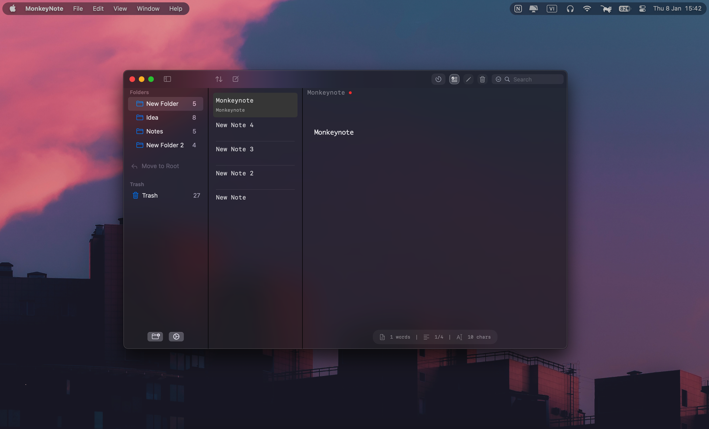

<div align="center">

# MonkeyNote


### A Modern Note-Taking Application for macOS

[](https://swift.org)
[](https://www.apple.com/macos/)
[](LICENSE)

<a href="https://ko-fi.com/calvados" target="_blank"></a>

</div>

## Overview

MonkeyNote is a minimalist, native macOS note-taking application built with SwiftUI. It provides a clean, distraction-free interface for organizing your thoughts with powerful features like markdown rendering, custom cursor controls, intelligent autocomplete, and hierarchical folder organization.

## Demo

> **Quick demo:** watch a short recording of MonkeyNote in action.

<p align="center">
  
</p>

## Screenshot

<p align="center">
  
</p>

## ✨ Features

- **Hierarchical Organization**: Create unlimited nested folders to organize your notes
- **Markdown Rendering**: Real-time markdown syntax highlighting and rendering
- **Obsidian**: Totally using Obsidian-style markdown syntax
- **Custom Cursor**: Configurable cursor width, blinking, and animation settings
- **Smart Autocomplete**: Intelligent word and line completion with customizable delay
- **Powerful Search**: Fast in-document search with match navigation
- **Drag & Drop**: Intuitive drag-and-drop support for notes and folders


## 📋 Requirements

- macOS 15.7 or later
- Xcode 16.2 or later (for building from source)

## Run from Source

   ```bash
   ./run.sh
   ```

## Build from Source

    ```bash
    ./build.sh
    ```


## Build with Xcode

See [doc/build.md](doc/build.md) for detailed build instructions.

## 🚀 Installation

### Download Pre-built App

- Download the latest `MonkeyNote.dmg` from the [Releases](https://github.com/cavaldos/MonkeyNote/releases) page


> **Note**: If macOS shows "app cannot be opened", go to **System Settings > Privacy & Security** and click **Open Anyway**.


## ⚙️ Configuration

MonkeyNote stores all notes and settings in your local file system:

- **Notes location**: `~/Documents/MonkeyNote/`
- **Settings**: Stored in UserDefaults

### Customizable Settings

Access settings via the gear icon in the sidebar:

- **Theme**: Light/Dark mode toggle
- **Font Family**: Monospaced, Rounded, or Serif
- **Font Size**: Adjustable text size
- **Cursor Settings**: Width, blinking, animation
- **Autocomplete**: Enable/disable, delay, opacity
- **Suggestion Mode**: Word or line completion
- **Markdown Rendering**: Toggle markdown preview
- **Vault Location**: Change notes storage location

## ⌨️ Keyboard Shortcuts

| Shortcut | Action |
|----------|--------|
| `⌘ + F` | Focus search field |
| `⏎` (in search) | Navigate to next match |
| `ESC` (in search) | Close search and return to editor |

## 🤝 Contributing

Contributions are welcome! Please feel free to submit a Pull Request.

1. Fork the repository
2. Create your feature branch (`git checkout -b feature/AmazingFeature`)
3. Commit your changes (`git commit -m 'Add some AmazingFeature'`)
4. Push to the branch (`git push origin feature/AmazingFeature`)
5. Open a Pull Request

## ⭐ Star History

<div align="center">

[](https://star-history.com/#cavaldos/MonkeyNote&Date)

</div>
